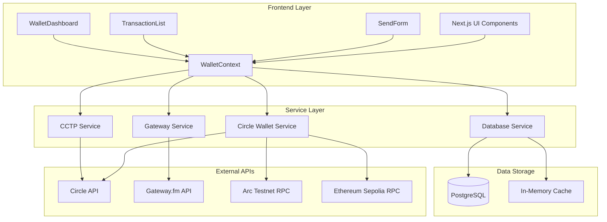
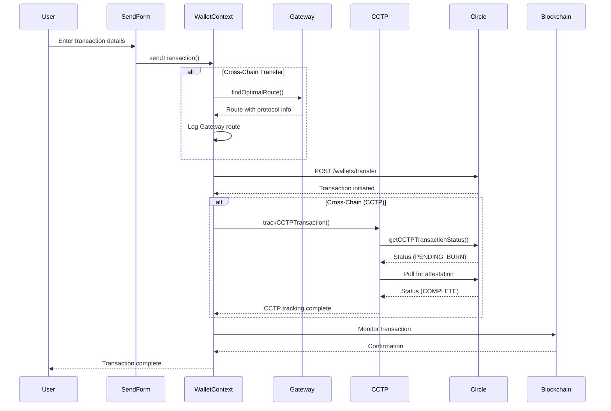
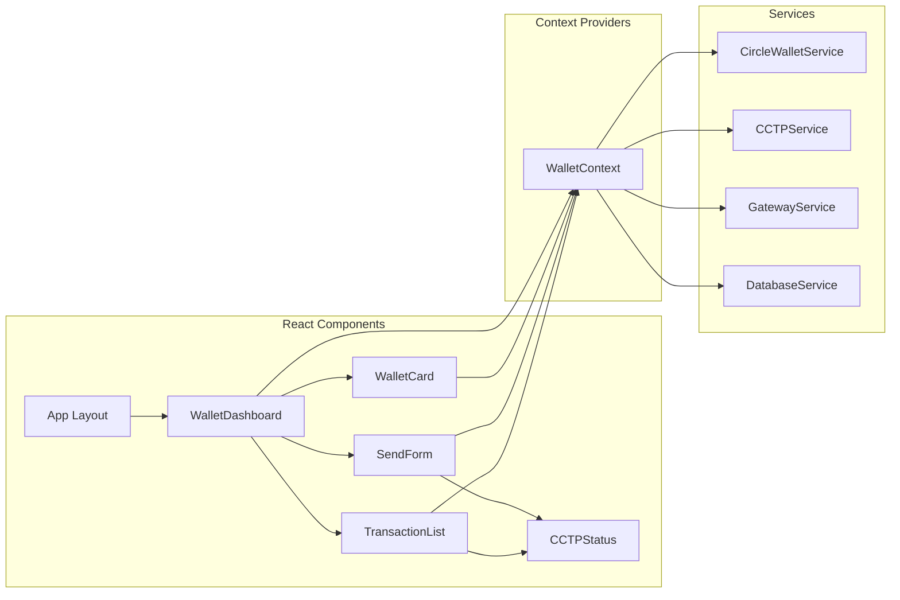
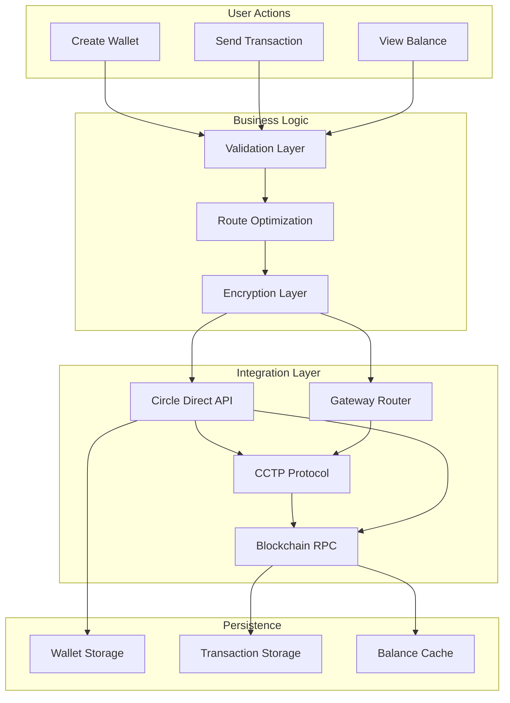
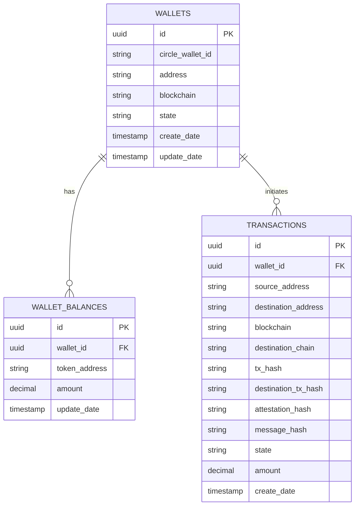
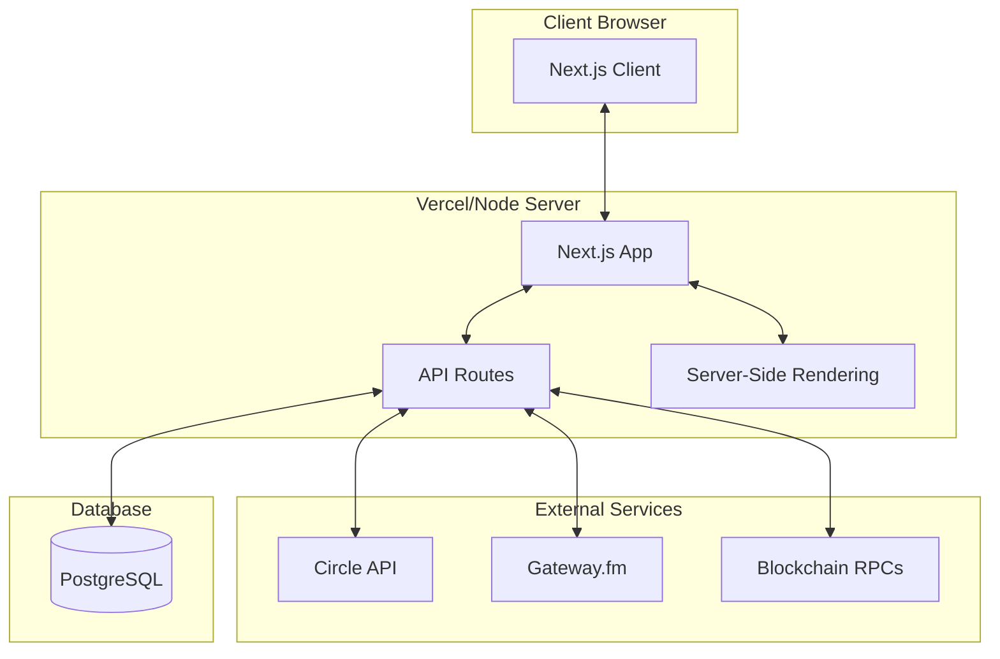

# Arc Cross-Chain Wallet Architecture

## System Overview



## Cross-Chain Transaction Flow



## Component Architecture



## Data Flow Architecture



## Technology Stack

### Frontend
- **Framework**: Next.js 14.2.33 (App Router)
- **Language**: TypeScript
- **Styling**: Tailwind CSS
- **State Management**: React Context API

### Backend Services
- **Circle Developer Wallets**: Custodial wallet management
- **CCTP**: Cross-Chain Transfer Protocol for USDC
- **Gateway.fm**: Route optimization for cross-chain transfers
- **PostgreSQL**: Primary data storage

### Blockchain Integration
- **Arc Testnet**: Arbitrum-based testnet
- **Ethereum Sepolia**: Ethereum testnet
- **Polygon Amoy**: Polygon testnet
- **Avalanche Fuji**: Avalanche testnet

### Security
- **Encryption**: RSA-OAEP for sensitive data
- **Authentication**: Circle API keys with entity secrets
- **Environment**: .env.local for configuration

## Key Features

### 1. Circle Developer-Controlled Wallets
- Automated wallet creation via Circle API
- Secure key management with RSA encryption
- Multi-chain support (ETH, ARC, MATIC, AVAX)

### 2. CCTP Integration
- Automatic detection of cross-chain transfers
- Real-time status tracking (burn → attestation → mint)
- Visual indicators for CCTP transactions
- Attestation hash tracking

### 3. Gateway Route Optimization
- Finds optimal routes for cross-chain transfers
- Displays estimated time and fees
- Non-breaking fallback to direct CCTP
- Protocol-agnostic design

### 4. Arc Testnet Support
- Native Arc Testnet wallet creation
- USDC transfers on Arc network
- Cross-chain bridging from Arc to other networks

### 5. Transaction Management
- Database persistence for all transactions
- Real-time balance fetching from blockchain
- Transaction history with CCTP status
- Graceful fallback to in-memory storage

## Database Schema



## API Routes

### Wallet Management
- `POST /api/wallets` - Create new wallet
- `GET /api/wallets` - List all wallets
- `GET /api/wallets/[id]` - Get wallet details
- `GET /api/wallets/[id]/balances` - Get wallet balance
- `POST /api/wallets/[id]/transactions` - Send transaction

### Testing & Health
- `GET /api/health` - Health check
- `GET /api/test/circle` - Test Circle API connection
- `GET /api/test/circle-direct` - Test Circle Direct client

## Environment Configuration

### Required Variables
```
CIRCLE_API_KEY=TEST_API_KEY:...
CIRCLE_CLIENT_KEY=TEST_CLIENT_KEY:...
CIRCLE_ENTITY_SECRET=...
CIRCLE_BASE_URL=https://api.circle.com
DATABASE_URL=postgresql://...
```

### Optional Variables
```
GATEWAY_API_KEY=...
ARC_API_KEY=...
NEXT_PUBLIC_WALLET_CONNECT_PROJECT_ID=...
```

## Deployment Architecture



## Error Handling & Resilience

### Database Fallback
- Primary: PostgreSQL connection
- Fallback: In-memory storage
- Automatic retry logic

### API Resilience
- Circle API errors → User-friendly messages
- Gateway unavailable → Direct CCTP routing
- Blockchain RPC failures → Alternative endpoints

### Transaction Safety
- Pre-validation of all inputs
- Idempotency for transaction creation
- Status polling with exponential backoff

## Future Enhancements

1. **Transaction Indexing**: Alchemy/Etherscan API integration
2. **Real Gateway Integration**: Replace mock with live Gateway.fm
3. **Multi-sig Support**: Enhanced security for high-value transfers
4. **Gas Optimization**: Dynamic fee estimation
5. **Mobile App**: React Native version
6. **Advanced Analytics**: Transaction history charts
7. **Wallet Recovery**: Backup and recovery mechanisms
8. **DeFi Integration**: Swap, stake, and yield features
